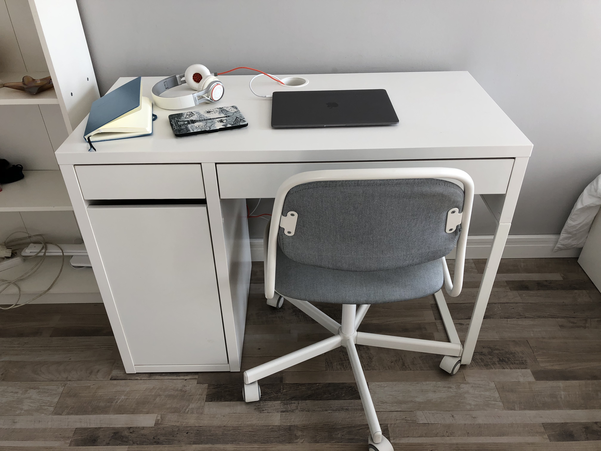
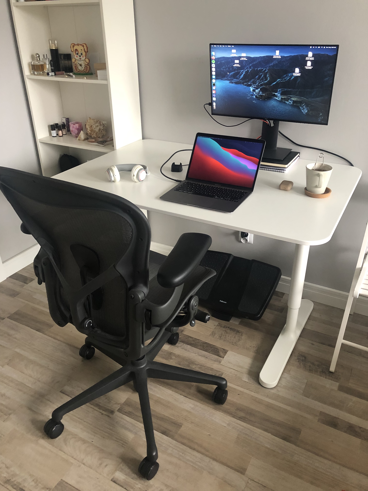

**Warning:** This article was seriously updated in August 2021, because time has shown that my previous setup was really bad for my health.

I like minimalism in my life and of course it affects my working desk. I think it is much easier to focus on what matters when you don't have some useless stuff on your desk. At the same time it can indicate that if your desk is empty it means that you have too much time and don't know how to use it bringing more value, but who cares, I like this :)

### Benefits of uncluttered desk

* Easier to focus
* Easier to clean

### Disadvantages

* You need to review things you see on your table pretty often and remove them

### First iteration setup (outdated one)

* **ÖRFJÄLL chair by IKEA**
* **MICKE desk by IKEA**
* **Macbook Air**
  * The best laptop I have ever used, it is portable and pretty fast for my tasks, what else do I need?
* **Notebook**
  * Useful to work on articles and books, when you need not only to read and forget, but think about what is written there
* **Pretty old Jabra headset**
  * Don't have any reason to change this to something new, it just works
* **Kindle Paperwhite**
  * Very convenient to send books to this device, but not sure that it is the best thing to read non-fiction books
* **Airpods**
  * I have forgotten to put them on the desk haha, but they are always there, because it is the best device for remote meetings

Problems with this setup:

1. You need to look down constantly because monitor of your notebook is pretty low, at the same time you can't make it higher, because keyboard will be higher too.
2. In some time you will find yourself sitting like a shrimp, because ÖRFJÄLL chair doesn't help you to sit straight and you can rely only on your self-control.

### Second iteration setup

* **BEKANT 120x80 desk by IKEA**
  * Much better than MICKE, because it is deeper and you can put monitor to the edge of the desk.
* **Aeron by Herman Miller**
  * Best chair ever, because of its mesh which forces you to sit correctly (your butt can't move out of you chair so you won't sit like a shrimp).
* **Fellowes Ultimate Foot Support**
  * This just adds some comfort to your sitting.
* **Macbook Air**
* **Dell U2421HE**
  * Good monitor for work, it will charge your Macbook when connected.
* **Pretty old Jabra headset**
* **Airpods**

### Bonus

You can see one of the cheapest IKEA chairs here and maybe you think, why you don't care about your posture and spine? But the thing is that you don't need very expensive chair to sir correctly and prevent pain in your spine.


